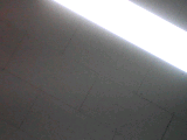

# Nicla Vision Camera Capture Notes



## Purpose

This note documents how the Nicla Vision camera was checked during bring-up and how the preview image above was produced. The final UART sketch does not transmit full images; it captures frames locally and sends only a compact brightness summary to the Portenta H7.

## Camera Configuration Used

| Test | Resolution | Format | Expected bytes |
| --- | --- | --- | --- |
| Final UART sender | QVGA, 320 x 240 | RGB565 | 153600 |
| Diagnostic preview capture | QQVGA, 160 x 120 | RGB565 | 38400 |

The converted preview image was generated from a complete 38400-byte QQVGA RGB565 capture. The raw byte stream was interpreted as big-endian RGB565 during conversion.

## Capture Method

1. Upload a temporary Nicla Vision camera capture sketch.
2. Start USB serial at 115200 baud.
3. Send a sync byte from the host to request one frame.
4. Receive exactly the expected number of RGB565 bytes.
5. Convert the byte stream to PNG for visual inspection.
6. Restore `examples/uart-communication/NiclaVision_Camera_UART_Sender` after the image capture check.

The first diagnostic transfer attempted to stream a full frame in one large write and sometimes produced incomplete files. The reliable diagnostic transfer sent the frame in 256-byte chunks with a short delay and serial flush between chunks.

## Result

The chunked QQVGA transfer repeatedly produced complete `38400/38400` byte captures. The preview image in `docments/assets/nicla-vision-camera-preview.png` confirms that the camera path, frame buffer, serial extraction, and RGB565 conversion are functional.

## Relation To The Final UART Sender

The final sender sketch uses the camera continuously at QVGA and sends result summaries like:

```json
{"source":"nicla_vision","seq":31,"status":"ok","frame_bytes":153600,"samples":4800,"avg_luma":137,"bright_samples":1074}
```

The reported `frame_bytes` value confirms the QVGA camera frame size used by the sender. The `avg_luma` and `bright_samples` fields are intentionally compact so they can be sent over a low-bandwidth UART link.

## Limitations

- The preview image is a bring-up verification capture, not an image-quality calibration target.
- Exposure, focus distance, lighting, and board orientation were not controlled.
- For reliable full-frame extraction over USB serial, keep the chunked transfer method or increase the host-side serial handling robustness.
