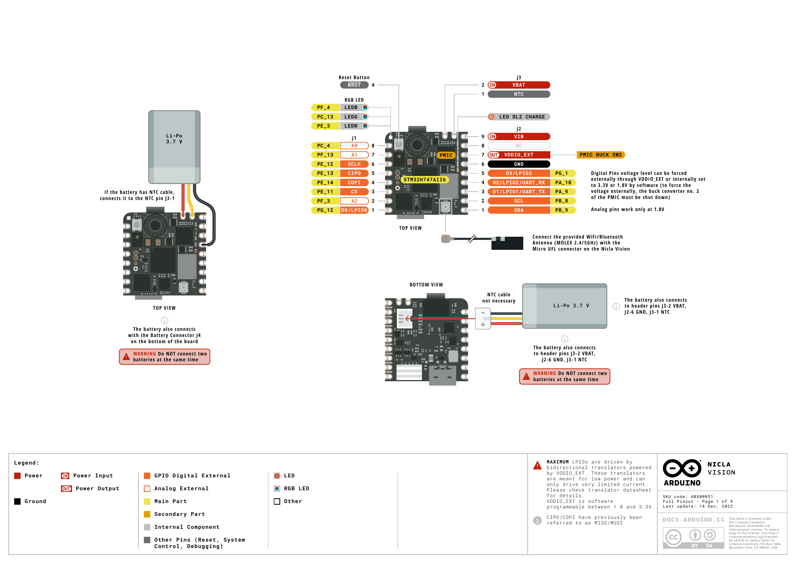

# Arduino Nicla Vision



## Board Role In This Setup

The Nicla Vision is the sensing and processing board for the two-board bring-up. Its final sketch captures camera frames, computes a compact brightness summary, and sends newline-terminated JSON messages to the Portenta H7 through `Serial1`.

## Main Hardware

| Area | Details |
| --- | --- |
| Board variant used | Nicla Vision, SKU ABX00051 |
| Microcontroller | ST STM32H747 dual-core microcontroller |
| High-performance core | Arm Cortex-M7 up to 480 MHz, double-precision FPU, L1 cache |
| Secondary core | Arm Cortex-M4 up to 240 MHz, FPU |
| Wireless module | Murata 1DX Wi-Fi and Bluetooth |
| Camera | GC2145 2 MP color camera |
| IMU | LSM6DSOX 6-axis accelerometer and gyroscope |
| Microphone | MP34DT06JTR digital MEMS microphone |
| Distance sensor | VL53L1 time-of-flight sensor |
| External flash | 16 MB serial flash |
| Security device | NXP SE050C2 secure element |
| Power management | On-board PMIC with battery support |
| Local Arduino FQBN | `arduino:mbed_nicla:nicla_vision` |

## Local Interface Use

| Interface | Use in this package | Status |
| --- | --- | --- |
| USB CDC | Upload, serial monitor, camera raw-byte capture | Verified |
| `Serial1` UART | Sends camera summary JSON to Portenta H7 | Verified |
| Camera | Used by official raw capture and final UART sender | Verified |
| PDM microphone | Tested with the official serial plotter example | Verified |
| IMU classifier | Official motion-intensity example compiled and uploaded | Verified |
| Wi-Fi and distance sensor | Available on board | Not used in this bring-up |

## UART And Power Pins Used

The installed Arduino Mbed Nicla core maps `Serial1` to the J2 header pins below:

| Nicla Vision pin | Arduino pin | Function | Connected to |
| --- | --- | --- | --- |
| J2-3 | D1 | `Serial1` TX / UART_TX | Portenta D13 RX |
| J2-4 | D2 | `Serial1` RX / UART_RX | Portenta D14 TX |
| J2-9 | VIN | Power input | Portenta +5V |
| J2-6 | GND | Common reference | Portenta GND |

The final sender sketch enables the external I/O rail before starting UART:

```cpp
Nicla_Vision.begin();
Nicla_Vision.enable3V3VDDIO_EXT();
Serial1.begin(115200);
```

This is required for reliable external header signaling on the tested setup.

## Arduino IDE Configuration

| Item | Value |
| --- | --- |
| Board package | Arduino Mbed OS Nicla Boards |
| Tested core version | `arduino:mbed_nicla@4.6.0` |
| IDE board selection | `Tools > Board > Arduino Mbed OS Nicla Boards > Arduino Nicla Vision` |
| Tested USB ports | Initially COM13, later COM17 after DFU upload |
| Upload transport | USB DFU through Arduino tooling |

If Windows reports a DFU driver error during upload, bind the Arduino WinUSB driver:

```powershell
pnputil /add-driver "$env:LOCALAPPDATA\Arduino15\packages\arduino\hardware\mbed_nicla\4.6.0\drivers\niclavision.inf" /install
```

## Verified Examples

| Example | Location | Result |
| --- | --- | --- |
| Blink | `examples/official-nicla-vision/Blink` | Compiled as a basic board/core check |
| PDMSerialPlotter | `examples/official-nicla-vision/PDMSerialPlotter` | Uploaded; serial output streamed microphone samples |
| CameraCaptureRawBytes | `examples/official-nicla-vision/CameraCaptureRawBytes` | Uploaded; host received camera frame bytes after sending the sync byte |
| NiclaVision_MLC_Motion_Intensity | `examples/official-nicla-vision/NiclaVision_MLC_Motion_Intensity` | Compiled after installing `STM32duino LSM6DSOX`; uploaded successfully |
| NiclaVision_Camera_UART_Sender | `examples/uart-communication/NiclaVision_Camera_UART_Sender` | Uploaded; Portenta H7 received JSON camera summaries over UART |

## Camera Data Notes

The tested camera examples use RGB565 frame buffers. A full QVGA frame from the final sender is 320 x 240 x 2 bytes, so the JSON payload reports `frame_bytes` as `153600`. A temporary QQVGA capture test used 160 x 120 x 2 bytes and produced a complete 38400-byte frame after the output was sent in smaller serial chunks.

The captured image preview is documented in [Nicla Vision camera capture notes](camera-capture.md).

## Operating Notes

- Recheck the COM port after every upload. The Nicla Vision can re-enumerate when moving between bootloader and runtime modes.
- For the validated UART link test, disconnect Nicla USB after uploading the sender sketch. Leave only Portenta USB connected to the PC and power Nicla from the Portenta +5V pin.
- The final sender prints local USB debug messages when Nicla USB is connected, but the verified board-to-board link is the `Serial1` UART path.
- The motion-classifier example needs `STM32duino LSM6DSOX` installed manually on a clean Arduino setup.

## Official Resources

- Product page: <https://store.arduino.cc/products/nicla-vision>
- Hardware documentation: <https://docs.arduino.cc/hardware/nicla-vision/>
- Pinout PDF: <https://docs.arduino.cc/resources/pinouts/ABX00051-full-pinout.pdf>
- Datasheet PDF: <https://docs.arduino.cc/resources/datasheets/ABX00051-datasheet.pdf>
- Schematics PDF: <https://docs.arduino.cc/resources/schematics/ABX00051-schematics.pdf>

Local copies are stored in `docments/assets`.
