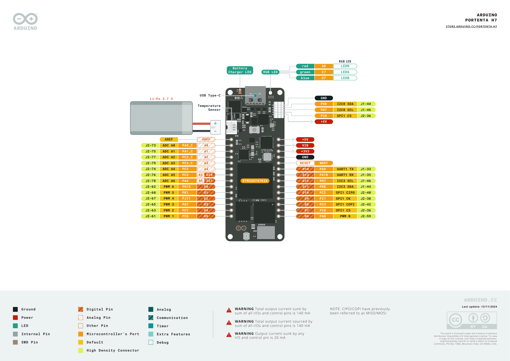

# Portenta H7 Hardware Reference



## Role In This Repository

The Portenta H7 is the receiver and host-side observation board for the two-board setup. It receives camera summary JSON lines from the Nicla Vision over `Serial1`, then forwards the received lines to the PC over USB serial.

## Main Hardware

| Area | Details |
| --- | --- |
| Board variant used | Full Portenta H7, SKU ABX00042 |
| Microcontroller | ST STM32H747XI dual-core microcontroller |
| High-performance core | Arm Cortex-M7 up to 480 MHz, double-precision FPU, L1 cache |
| Secondary core | Arm Cortex-M4 up to 240 MHz, FPU |
| Internal memory | 2 MB flash, 1 MB RAM |
| External memory | 8 MB SDRAM, 16 MB QSPI flash |
| Wireless module | Murata 1DX Wi-Fi and Bluetooth |
| Wired connectivity | USB-C, 10/100 Ethernet PHY through expansion, UART, SPI, I2C, CAN |
| Security devices | ATECC608 and NXP SE050C2 secure elements on the full H7 variant |
| Expansion | MKR-style edge pins plus two 80-pin high-density connectors |
| Arduino FQBN | `arduino:mbed_portenta:envie_m7` |

## Interfaces Used By The Examples

| Interface | Use in this repository |
| --- | --- |
| USB CDC | Upload and serial monitor |
| `Serial1` UART | Receives Nicla Vision JSON lines |
| SDRAM | Used by the official SDRAM example |
| Wi-Fi | Used by the official network scan example |
| Reset reason API | Used by the official reset reason example |
| Ethernet, CAN, SPI, I2C | Available through board connectors for future expansion |

## UART And Power Pins Used

The installed Arduino Mbed Portenta core maps `Serial1` to the following pins:

| Portenta H7 pin | Arduino core symbol | Function | Connected to |
| --- | --- | --- | --- |
| D14 | `PIN_SERIAL_TX` | `Serial1` TX | Nicla J2-4 UART_RX |
| D13 | `PIN_SERIAL_RX` | `Serial1` RX | Nicla J2-3 UART_TX |
| +5V | 5 V rail | Nicla VIN supply | Nicla J2-9 VIN |
| GND | Ground | Common reference | Nicla J2-6 GND |

The project receiver sketch prints this mapping at boot:

```text
Listening on Serial1: D13/RX, D14/TX at 115200 baud
```

## Arduino IDE Configuration

| Item | Value |
| --- | --- |
| Board package | Arduino Mbed OS Portenta Boards |
| Board package version used | `arduino:mbed_portenta@4.6.0` |
| IDE board selection | `Tools > Board > Arduino Mbed OS Portenta Boards > Arduino Portenta H7` |
| Example local USB ports | COM12 initially, COM15 after DFU upload |
| Upload transport | USB DFU through Arduino tooling |

If Windows shows a DFU driver error during upload, bind the Arduino WinUSB driver:

```powershell
pnputil /add-driver "$env:LOCALAPPDATA\Arduino15\packages\arduino\hardware\mbed_portenta\4.6.0\drivers\portentah7.inf" /install
```

## Included Examples

| Example | Location | Result |
| --- | --- | --- |
| Blink | `examples/official-portenta-h7/Blink` | Basic board package check |
| STM32H747_getResetReason | `examples/official-portenta-h7/STM32H747_getResetReason` | Reset reason serial example |
| SDRAM_operations | `examples/official-portenta-h7/SDRAM_operations` | External SDRAM check |
| ScanNetworksAdvanced | `examples/official-portenta-h7/ScanNetworksAdvanced` | Wi-Fi scan check |
| PortentaH7_UART_Receiver | `examples/uart-communication/PortentaH7_UART_Receiver` | Final UART receiver for this repository |

## Operating Notes

- Recheck the COM port after every upload. The Portenta can re-enumerate when moving between bootloader and runtime modes.
- The UART receiver can run with only the Portenta connected to the PC over USB.
- For the final UART check, power Nicla Vision from the Portenta +5V pin and disconnect the Nicla USB cable.
- The receiver sketch is intentionally simple. It counts bytes and newline-terminated payloads so link health can be checked without depending on a full JSON parser.

## Official Resources

- Product page: <https://store-usa.arduino.cc/products/portenta-h7>
- Hardware documentation: <https://docs.arduino.cc/hardware/portenta-h7/>
- Pinout PDF: <https://docs.arduino.cc/resources/pinouts/ABX00042-full-pinout.pdf>
- Datasheet PDF: <https://docs.arduino.cc/resources/datasheets/ABX00042-ABX00045-ABX00046-datasheet.pdf>
- Schematics PDF: <https://docs.arduino.cc/resources/schematics/ABX00042-schematics.pdf>

Local copies are stored in `docments/assets`.
